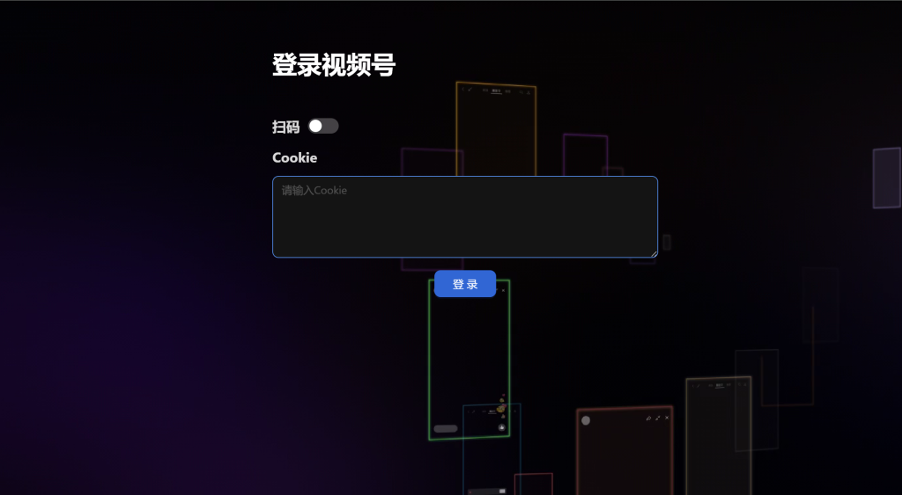
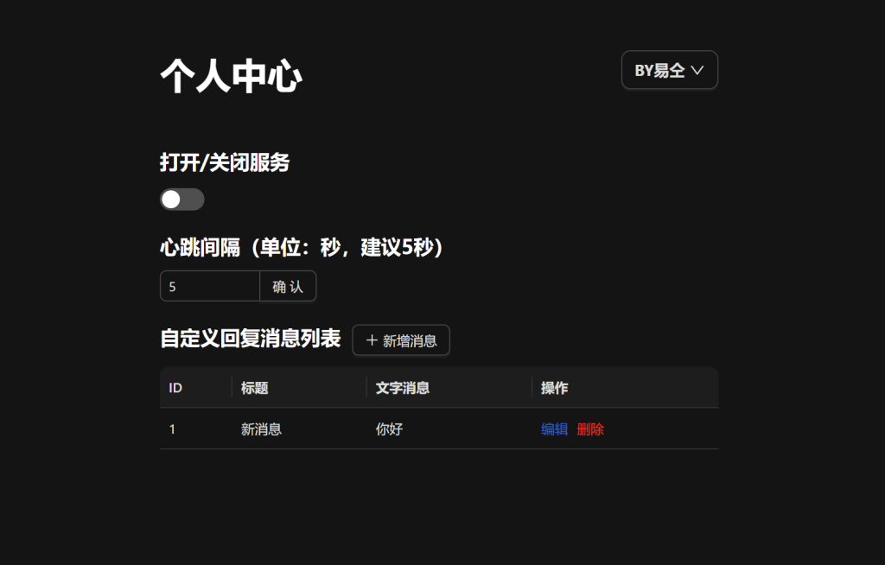
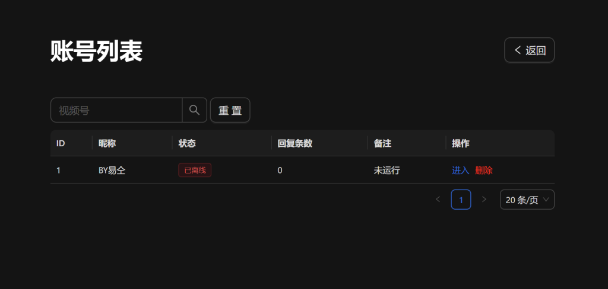

# 微信视频号 打招呼自动回复 网页端

## 功能
- 自动回复打招呼消息
- 自定义回复内容
- 支持多条回复随机回复
- 多账号管理

## 后端地址
https://github.com/1944876825/wx_sph_server

## 使用方法
1. 运行指令
    ```bash
    yarn build
    ```
2. 把生成的dist内文件放在后端项目 public/dist
3. 运行后端项目即可

## 界面预览




## LICENSE

[MIT](https://opensource.org/license/mit/)